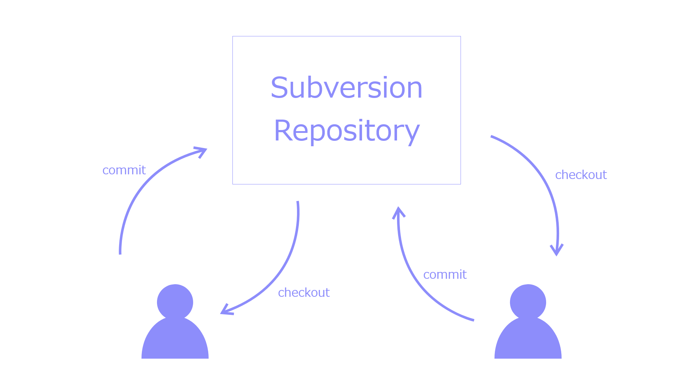
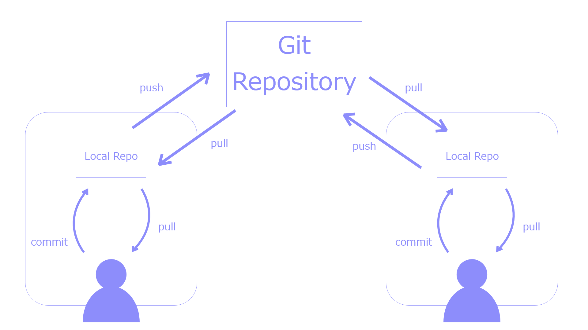
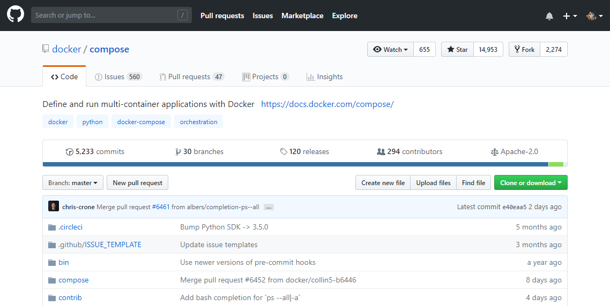
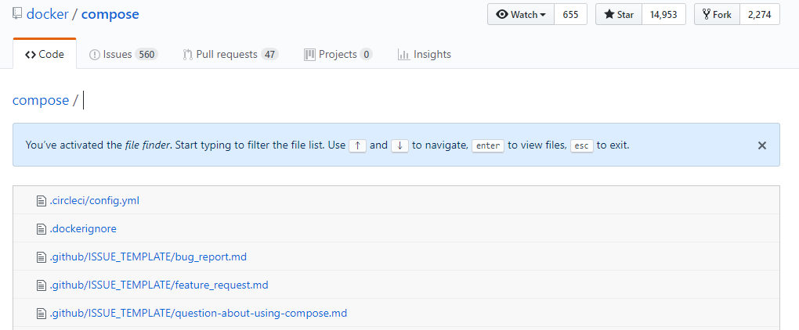
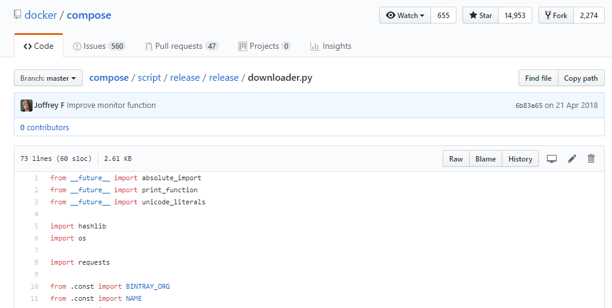

# GitHub入門

---
## GitHubとは？

- Gitのリポジトリホスティングサービス

+++
## Gitとは？

- 分散型バージョン管理システム
- バージョン管理システムの例|
  - Subversion|
  - Mercurial|

+++
### 集中型バージョン管理システム

+++
### 分散型バージョン管理システム


+++
## Gitのインストール

- Windowsのみ。Mac、Linuxはデフォルトでインストール済み。

+++
## Gitの設定
- 名前・メールアドレスを設定しておく
```
git config --global user.name "FirstName LastName"
git config --global user.email "hoge@hoge.hoge"
```

---

GitHubアカウント作成
## 省略！

---

## Gitの基本操作
- git init
- git status
- git add
- git commit
- git log

+++
## ブランチ
- git branch
- git checkout
- git reset --hard
- git reflog
- コンフリクト
  - git commit --amend
  - git rebase

+++

## リモートリポジトリ
- git remote add
- git push
- git clone
- git pull
- git fetch

---

## GitHub

+++


- docker composeのリポジトリ

---

## GitHubの特徴
- リポジトリページで見るところ

+++

## Watch/Star/Fork
- Watch
  - 更新などを通知して見ている人の数。主に開発関係者。
- Star
  - お気に入り。後で参照したいときなど。
  - リポジトリの注目度合いとして見られている
- Fork
  - PullRequestを送るためなどで分岐したリポジトリの数

+++


- t

+++

## 歴史の閲覧


+++

## 差分の閲覧
- リポジトリ名/compare/比較A...比較B
- master@{7.day.ago}...master
- master@{yyyy-mm-dd}...master

+++

## Issue
  - GFM
    - タスクリスト記法
    - []
    - [x]
  - Labels
  - Milestone

+++

## Issue
  - テンプレートやガイドライン
    - ISSUE_TEMPLATE.md
    - CONTRIBUTING.md
    - PULL_REQUEST_TEMPLATE.md
  - コミットメッセージ
    - #id
    - close

+++

## Pull Request
- Conversation
- Commits
- Files changed
  - インラインコメント

+++

## その他
- Wiki
- Insights

---
## Pull Request
---
## Git Flow
+++
## A successful Git branching model


---

## さいごに
- 個人利用でも大いに役立つ
- とにかく使ってみる

+++
## 参考文献
- GitPitchの使い方（公式ドキュメント）
  - https://gitpitch.com/docs
- 日本語で参考にしたページ
  - GitHubだけで超高機能なスライド資料が作れる「GitPitch」の使い方を徹底解説！
  - https://paiza.hatenablog.com/entry/2017/06/22/GitHub%E3%81%A0%E3%81%91%E3%81%A7%E8%B6%85%E9%AB%98%E6%A9%9F%E8%83%BD%E3%81%AA%E3%82%B9%E3%83%A9%E3%82%A4%E3%83%89%E8%B3%87%E6%96%99%E3%81%8C%E4%BD%9C%E3%82%8C%E3%82%8B%E3%80%8CGitPitch%E3%80%8D%E3%81%AE

---

<div style="text-align: center;">
<span style="font-size: 200%;">終</span><br/>
<u>制作・著作</u><br/>
ysmn
</div>
