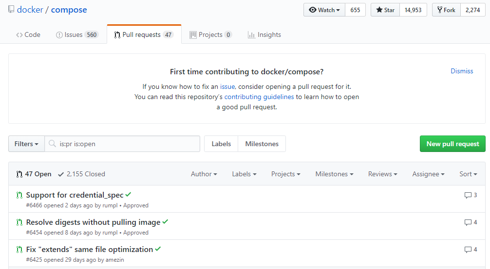
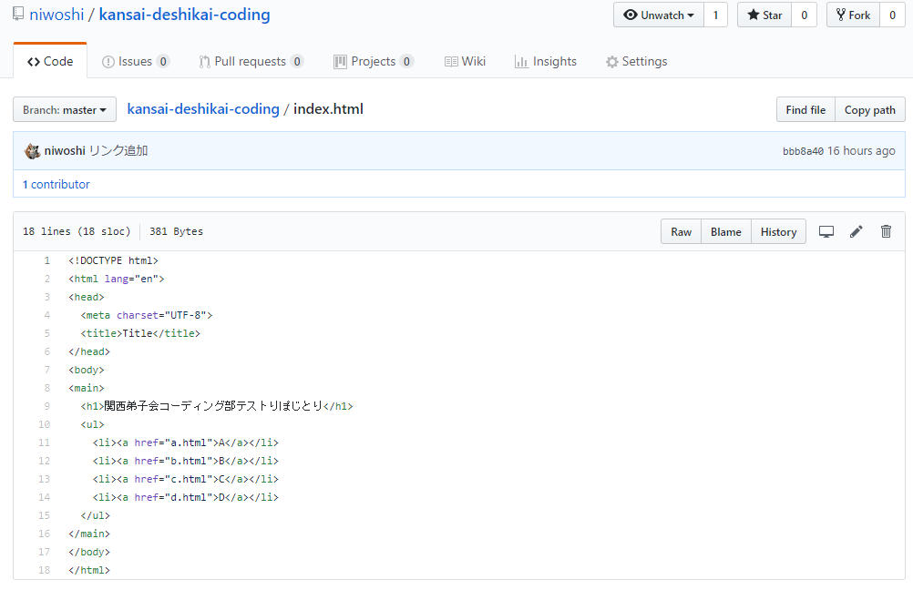
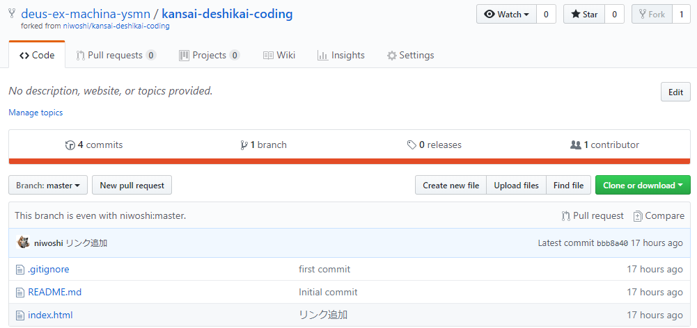
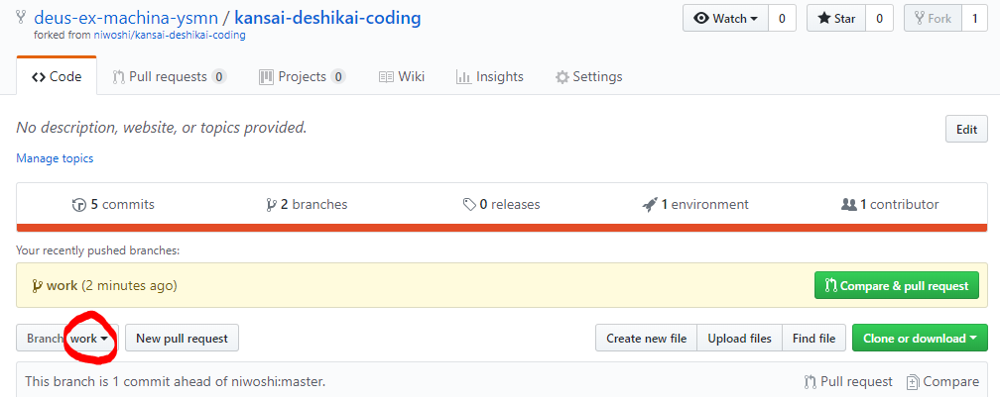
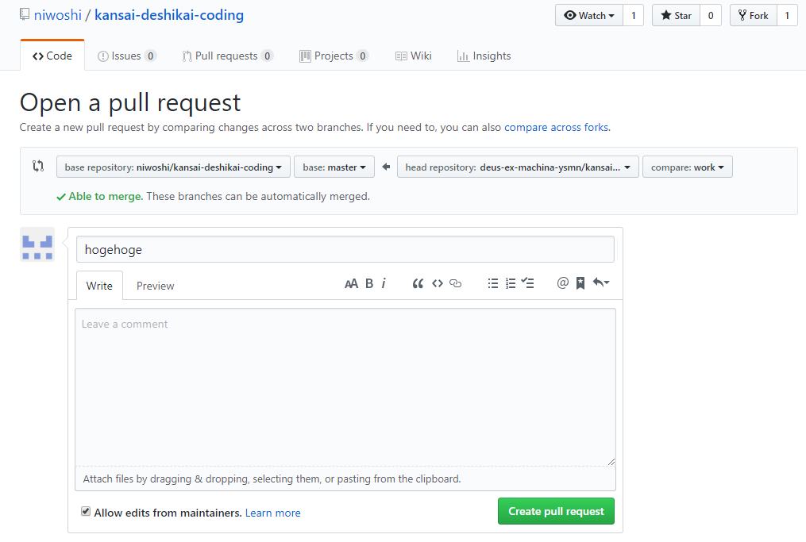
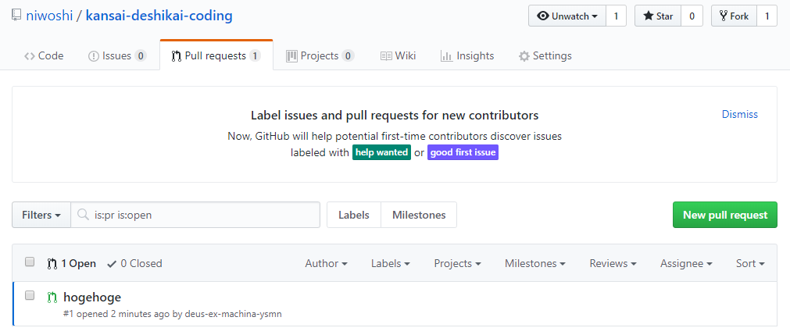
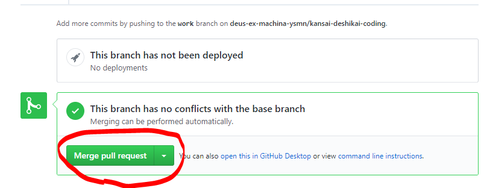

# GitHub入門
Note:
GitのインストールとGitHubアカウントの作成は事前にやって貰うが吉

---
## GitHubとは？

- Gitのリポジトリホスティングサービス

+++
## Gitとは？

- 分散型バージョン管理システム
- バージョン管理システムの例|
  - Subversion|
  - Mercurial|

+++
### 集中型バージョン管理システム

+++
### 分散型バージョン管理システム


+++
## Gitのインストール

- ~~Windowsのみ。Mac、Linuxはデフォルトでインストール済み。~~
- Windowsはインストーラ、MacはXcodeのコマンドラインツール、Linuxはディストリ次第ですがパッケージ管理ツールなどでインストール

+++
## Gitの設定
- 名前・メールアドレスを設定しておく
```
git config --global user.name "FirstName LastName"
git config --global user.email "hoge@hoge.hoge"
```

---

GitHubアカウント作成
## 省略！

---

## Gitの基本操作
- git init
- git status
- git add
- git commit
- git log

+++
### ブランチ
- git branch
- git checkout
- git reset --hard
- git reflog
- コンフリクト
  - git commit --amend
  - git rebase

+++

### リモートリポジトリ
- git remote add
- git push
- git clone
- git pull
- git fetch

---

## GitHub

+++


- docker composeのリポジトリ

---

### GitHubの特徴
- リポジトリページで見るところ

+++

### Watch/Star/Fork
- Watch
  - 更新などを通知して見ている人の数。主に開発関係者。
- Star
  - お気に入り。後で参照したいときなど。
  - リポジトリの注目度合いとして見られている
- Fork
  - PullRequestを送るためなどで分岐したリポジトリの数

+++


- t

+++

### 歴史の閲覧


+++

### 差分の閲覧
- リポジトリ名/compare/比較A...比較B
- master@{7.day.ago}...master
- master@{yyyy-mm-dd}...master

+++

### Issue
  - GFM
    - タスクリスト記法

```
- [x] Foo
- [ ] Bar
- [ ] Baz
```

  - Labels
  - Milestone

+++

- テンプレートやガイドライン
  - ISSUE_TEMPLATE.md
  - CONTRIBUTING.md
  - PULL_REQUEST_TEMPLATE.md
- コミットメッセージ
  - #id
  - close

+++

### Pull Request


+++

- Conversation
- Commits
- Files changed
  - インラインコメント

+++

### その他
- Wiki
- Insights

---

## GitHubPages

+++

### なんやねん
- GitHubのリポジトリ上でウェブホスティングできる
- たぶんVue.jsとか使えばウェブアプリ公開もできる


+++

### まぁ見てよ
https://niwoshi.github.io/kansai-deshikai-coding/

+++




---

## Pull Request

+++

### 実際にプルリクを送ろう！

+++

### まずFork


+++

### 修正する
- clone
```
git clone git@github.com:deus-ex-machina-ysmn/kansai-deshikai-coding.git
cd kansai-deshikai-coding
```

+++

- ブランチを切る
  - Pull Requestを送るときに、ブランチベースで送る
```
git checkout -b work master
```

+++

- 修正できたらコミット＋自分のリモートリポジトリを更新
```
git status
git add .
git status
git commit -m "hogehoge"
git push origin work
```

+++



+++

### Pull Requestを送る


+++

### Pull Requestの使いどころ
- 誰か助けて！という時にプルリクを送る文化があるらしい
- WIP(Work In Progress)

+++

### Forkしたrepoのメンテナンス
- remote add upstream 元リポジトリURL
- fetch upstream
- merge upstream/master

---

## Pull Requestを受け取ったら
- コードレビュー
- 自分の環境で確認
+++


- 必ずコードレビューから

+++

### 自分の環境で確認
- git pullなどで更新
  - 最新の状態にするのを忘れずに

+++

- Pull Requestのブランチを取り込む
```
git remote add pr_user url
git fetch pr_user
git chechout -b test_branch pr_user/work
```

+++

- 確認

+++

- OKだったらさっきのブランチは要らないので消しとく
```
git branch -D test_branch
```

+++

- マージする


---

## GitHub Flow

---

## Git Flow

+++

## A successful Git branching model


---

## 補足：GitPitch

+++

### GitHubを使ったスライド
- 結構便利かも
- インターネットに繋がってればどこでもスライド

+++

### グラフやチャートの表示


<canvas data-chart="line">
<!--
{
 "data": {
  "labels": ["January"," February"," March"," April"," May"," June"," July"],
  "datasets": [
   {
    "data":[65,59,80,81,56,55,40],
    "label":"My first dataset","backgroundColor":"rgba(20,220,220,.8)"
   },
   {
    "data":[28,48,40,19,86,27,90],
    "label":"My second dataset","backgroundColor":"rgba(220,120,120,.8)"
   }
  ]
 },
 "options": { "responsive": "true" }
}
-->
</canvas>

---

## さいごに
- 個人利用でも大いに役立つ
- とにかく使ってみる

+++

## 参考文献
- GitHub実践入門
  - https://amzn.to/2syZmy2
- GitHubのIssue・Pull Requestのテンプレート機能を使おう
  - https://bit.ly/2ARFeMr
- Git-flowって何？
  - https://bit.ly/2Ryr6lv

+++

### GitPitch
- GitPitchの使い方（公式ドキュメント）
  - https://gitpitch.com/docs
- 日本語で参考にしたページ
  - GitHubだけで超高機能なスライド資料が作れる「GitPitch」の使い方を徹底解説！
    - https://bit.ly/2W3jVQV
  - HowToUseGitPitch2
    - https://bit.ly/2Dk6C7f

---

<div style="text-align: center;">
<span style="font-size: 200%;">終</span><br/>
<u>制作・著作</u><br/>
ysmn
</div>
